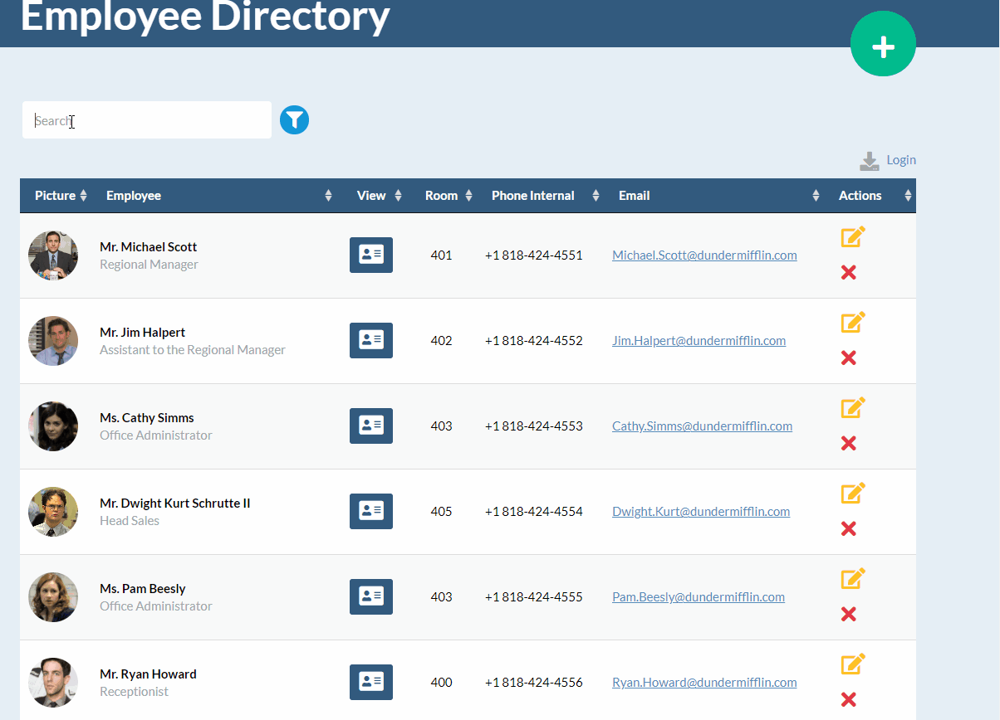
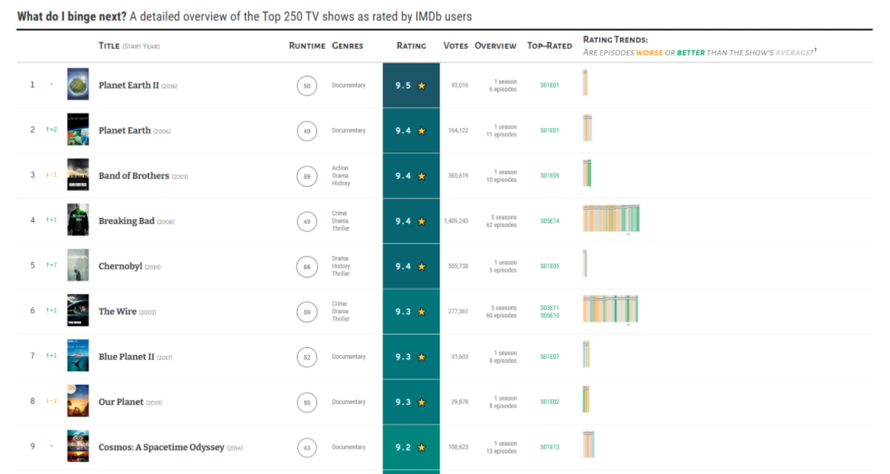
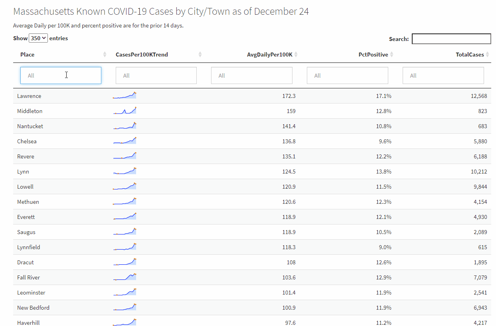

class: center, middle



---
class: center, middle


---
Combine table data with mini data visualizations (sparklines):


---
## 📦 options for interactive HTML tables:

--
### DT

--
### reactable

---
#### Get latest Covid data by state:

```{r}
library(dplyr)
state_data <- rio::import("data/latest_covid_by_state.csv") %>%
  select(state, newCasesPer100K = metrics.caseDensity, testPositivity = metrics.testPositivityRatio, lastUpdatedDate) %>%
  mutate(
    newCasesPer100K = round(newCasesPer100K, 1),
    testPositivity = round(testPositivity, 3)
  ) %>%
  arrange(desc(newCasesPer100K))

```

---

## DT default [https://rstudio.github.io/DT/](https://rstudio.github.io/DT/)

```{r eval=TRUE}
DT::datatable(state_data, options = list(pageLength = 6))
```

---
## reactable default

```{r eval=TRUE}
reactable::reactable(state_data)
```

---
## DT advantages

Built-in filters sensitive to data type

```{r}
DT::datatable(state_data, options = list(pageLength = 6), filter = 'top')
```

---
## DT advantages (cont)

- Built-in filters sensitive to data type - major advantage over reactable
- Better defaults (although reactable easily customized)
- Easy to enable search by regular expression
- Numerous extensions and plug-ins for things like buttons to download data

---

```{r }
library(DT)
datatable(state_data,  filter = 'top', extensions = 'Buttons', 
options = list(pageLength = 6, dom = 'Bfrtip', 
          buttons = c('copy', 'csv', 'excel', 'pdf', 'print')) )

```

---
## Reactable advantages

Easy to allow user to change column widths
```{r}
library(reactable)
reactable(state_data, resizable = TRUE, searchable = TRUE)

```

---
## Reactable advantages (cont)

Expandable rows

Example: [http://apps.machlis.com/shiny/nicar20_resources/](http://apps.machlis.com/shiny/nicar20_resources/)

---
## Both packages

- Well documented with many examples
- Highly customizable
- Sparklines!

---


