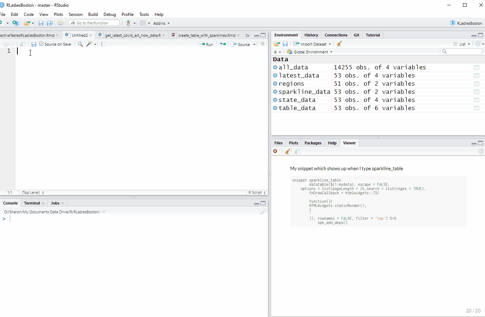

```{r setup, echo=FALSE, warning = FALSE, message = FALSE}
knitr::opts_chunk$set(fig.retina = 3)
# Allow using #<< to highlight code
# per https://www.garrickadenbuie.com/blog/highlight-lines-without-breaking-the-code-in-xaringan/
hook_source <- knitr::knit_hooks$get('source')
knitr::knit_hooks$set(source = function(x, options) {
  x <- stringr::str_replace(x, "^[[:blank:]]?([^*].+?)[[:blank:]]*#<<[[:blank:]]*$", "*\\1")
  hook_source(x, options)
})
```

class: center, middle
## Winner: [RStudio Table Contest](https://blog.rstudio.com/2020/12/23/winners-of-the-2020-rstudio-table-contest/)


---
class: center, middle
[RStudio Table Contest Honorable Mention](https://blog.rstudio.com/2020/12/23/winners-of-the-2020-rstudio-table-contest/)


---
## I've found useful:
Combine a searchable, sortable table of _latest_ data with mini data visualizations (sparklines) showing _trends_:


---
## 📦 options for interactive HTML tables:

--
### DT

--
### reactable

---
#### Example: Latest Covid Data by State
Import CSV file into R

```{r}
library(dplyr)
state_data <- rio::import("data/latest_covid_by_state.csv") %>%
  select(state, newCasesPer100K = metrics.caseDensity, testPositivity = metrics.testPositivityRatio, lastUpdatedDate) %>%
  mutate(
    newCasesPer100K = round(newCasesPer100K, 1),
    testPositivity = round(testPositivity, 3)
  ) %>%
  arrange(desc(newCasesPer100K))

```

---

## Basic DT table default [https://rstudio.github.io/DT/](https://rstudio.github.io/DT/)

```{r eval=TRUE}
DT::datatable(state_data, options = list(pageLength = 6))
```

---
## Basic reactable table default

```{r eval=TRUE}
reactable::reactable(state_data)
```

---
## DT advantages

Built-in filters sensitive to data type

```{r}
DT::datatable(state_data, options = list(pageLength = 6), filter = 'top')
```

---
## DT advantages (cont)

- Built-in filters sensitive to data type - major advantage over reactable
- Better defaults (although reactable easily customized)
- Easy to enable search by regular expression
- Numerous extensions and plug-ins for things like buttons to download data

---

```{r }
library(DT)
datatable(state_data,  filter = 'top', extensions = 'Buttons', 
options = list(pageLength = 6, dom = 'Bfrtip', 
          buttons = c('copy', 'csv', 'excel', 'pdf', 'print')) )

```

---
## Reactable advantages

Easy to allow user to change column widths
```{r}
library(reactable)
reactable(state_data, resizable = TRUE, searchable = TRUE)

```

---
## Reactable advantages (cont)

Expandable rows

Example: [http://apps.machlis.com/shiny/nicar20_resources/](http://apps.machlis.com/shiny/nicar20_resources/)

---
## Both packages

- Well documented with many examples
- Highly customizable
- Sparklines!

---

## Code review: Create sparkline data frame

Group and summarize by state to get one row for each state

```{r eval=FALSE}
sparkline_data <- all_data %>%
  filter(date >= as.Date("2020-04-01")) %>%
  slice(which(row_number() %% 7 == 1)) %>%
*  group_by(state) %>%
*  summarize(
    CasesPer100KTrend = spk_chr(
      newCasesPer100K, type ="line",
      chartRangeMin = 0, 
      chartRangeMax = max(newCasesPer100K, na.rm = TRUE)
    )
  )

```

---
Use sparkline package's `spk_chr()` function to create new column CasesPer100KTrend with the sparkline.

Arguments are the column with data (`newCasesPer100K`), sparkline type (`"line"`), and optional y-axis min and max values.

```{r eval=FALSE}
sparkline_data <- all_data %>%
  filter(date >= as.Date("2020-04-01")) %>%
  slice(which(row_number() %% 7 == 1)) %>%
  group_by(state) %>%
  summarize(
*    CasesPer100KTrend = spk_chr(
*      newCasesPer100K, type ="line",
*      chartRangeMin = 0, 
*      chartRangeMax = max(newCasesPer100K, na.rm = TRUE)
    )
  )

```

---
## Code review: Create table with sparklines

`escape = FALSE` evaluates HTML to display as if it was on a Web page instead of showing the actual HTML code

```{r eval = FALSE}
datatable(table_data, 
*         escape = FALSE, 
          options = list(pageLength = 25,
          search = list(regex = TRUE),
          fnDrawCallback = htmlwidgets::JS(
                                      '
function(){
  HTMLWidgets.staticRender();
}
'
)), rownames = FALSE, filter = 'top') %>%
      spk_add_deps()   %>%
      formatPercentage("testPositivity", digits = 1)
 
```

---
This is optional - I'm enabling searching by regular expression

```{r eval = FALSE}
datatable(table_data, 
          escape = FALSE, 
          options = list(pageLength = 25,
          * search = list(regex = TRUE),
          fnDrawCallback = htmlwidgets::JS(
                                      '
function(){
  HTMLWidgets.staticRender();
}
'
)), rownames = FALSE, filter = 'top') %>%
      spk_add_deps()   %>%
      formatPercentage("testPositivity", digits = 1)
 
```

---
These lines of code are critical for the sparkline HTML to display as sparklines. They are the same for every table, and I've saved them as an RStudio code snippet.

```{r eval = FALSE}
datatable(table_data, 
          escape = FALSE, 
          options = list(pageLength = 25,
          search = list(regex = TRUE),
*          fnDrawCallback = htmlwidgets::JS(
*                                      '
* function(){
*  HTMLWidgets.staticRender();
* }
* '
)), rownames = FALSE, filter = 'top') %>%
*      spk_add_deps()   %>%
      formatPercentage("testPositivity", digits = 1)
 
```

---
My snippet which shows up when I type sparkline_table

```{r eval = FALSE}
snippet sparkline_table
		datatable(${1:mydata}, escape = FALSE, 
	options = list(pageLength = 25,search = list(regex = TRUE),
		fnDrawCallback = htmlwidgets::JS(
		   '
		function(){
		HTMLWidgets.staticRender();
		}
		'
		)), rownames = FALSE, filter = 'top') %>%
			spk_add_deps()

```

---



---
## Code review: Create table with expandable row

#### Add styling and options to default reactable: row stripes, reaction when hovering over a table row, allow columns to be resized, add search box.

```{r eval = FALSE}
reactable(my_recipes, 
*          striped = TRUE, highlight = TRUE, 
*           resizable = TRUE, searchable = TRUE)


```

```{r echo = FALSE}
my_recipes <- import("data/cranberry_recipes.xlsx") %>%
  mutate(
    Source = glue("<a title='{OriginalSource}' href='{URL}'>{OriginalSource}</a> ")
  ) %>%
  select(-OriginalSource, -URL)
reactable(my_recipes, striped = TRUE, highlight = TRUE, resizable = TRUE, searchable = TRUE)
```

---
#### Add column definition for Source column so HTML displays as HTML

```{r}
reactable(my_recipes, striped = TRUE, highlight = TRUE, resizable = TRUE, searchable = TRUE,
          columns = list(  #<<
            Source = colDef(html = TRUE)  #<<
          )  #<<
)  
```

---

#### Hide Instructions row, add function for expandable row


```{r}
# Function needed according to Greg Lin, creator of reactable #<<
html <- function(x, inline = FALSE) { #<<
  container <- if (inline) htmltools::span else htmltools::div #<<
  container(dangerouslySetInnerHTML = list("__html" = x)) #<<
}  #<<

reactable(my_recipes, striped = TRUE, highlight = TRUE, resizable = TRUE, searchable = TRUE,
          columns = list(  
            Source = colDef(html = TRUE),
            Instructions = colDef(show = FALSE) #<<
          )  
)
```

---

#### Finally, add details function to make the expandable rows come to life

```{r}
# Function needed according to Greg Lin, creator of reactable 
html <- function(x, inline = FALSE) { 
  container <- if (inline) htmltools::span else htmltools::div 
  container(dangerouslySetInnerHTML = list("__html" = x)) 
}  

reactable(my_recipes, striped = TRUE, highlight = TRUE, resizable = TRUE, searchable = TRUE,
          columns = list(  
            Source = colDef(html = TRUE),
            Instructions = colDef(show = FALSE) #<<
          ),
            # if Instructions exist, make that expandable  #<<
            details = function(index) { #<<
              if(my_recipes$Instructions[index] != "") { #<<
                htmltools::tagList( #<<
                  html(my_recipes$Instructions[index]) #<<
                ) #<<
              } #<<
            } #<<
)
```

---
class: center

# I. Will. Never. Remember. This.


---
## Code snippet!

```{r eval=FALSE}
snippet expandable_row_table
  # Function needed according to Greg Lin, creator of reactable
  html <- function(x, inline = FALSE) {
    container <- if (inline) htmltools::span else htmltools::div
    container(dangerouslySetInnerHTML = list("__html" = x))
  }
  reactable(${1:mydf}, striped = TRUE, highlight = TRUE, resizable = TRUE,   searchable = TRUE,
            columns = list(
              Source = colDef(html = TRUE),
              ${2:mycol} = colDef(show = FALSE)
            ),
              # if ${2:mycol} exist, make that expandable
              details = function(index) {
                if(${1:mydf}[['${2:mycol}']][index] != "") {
                  htmltools::tagList(
                    html(${1:mydf}[['${2:mycol}']][index])
                  )
                } 
              }
  )

```

---
# Additional Resources

DT site: 

reactable site:

My sparklines in tables tutorial:

My expandable rows tutorial:

My code snippets tutorial:

My Do More With R tutorials:

Link to this presentation's resources:
---


